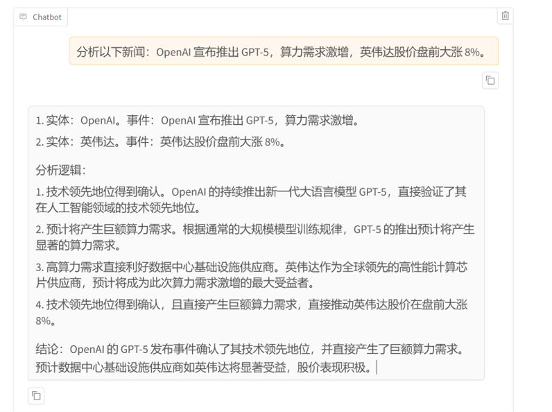

# FinSight-7B-LoRA: Financial Logic & Risk Analysis Expert

  

## 📖 Project Overview (项目简介)
**FinSight-7B** is a specialized Large Language Model (LLM) designed for financial sentiment analysis and risk assessment. 

Unlike general-purpose models, FinSight is fine-tuned to:
1.  **Deep Reasoning (CoT)**: Analyze financial news with a "Chain-of-Thought" process before concluding.
2.  **Structured Output**: Strictly follow JSON format for entity extraction and risk leveling.
3.  **Domain Expertise**: Detect subtle bullish/bearish signals in complex supply chain relationships.

This project demonstrates the end-to-end pipeline of **Data Engineering (Distillation)**, **Efficient Fine-tuning (QLoRA)**, and **Model Evaluation**.

---

## 📊 Performance (效果展示)

### 1. Training Loss Convergence
The model was trained on an NVIDIA RTX 4090. The loss converged significantly around Step 20, indicating rapid adaptation to the domain logic.


*(这里会自动显示你放在 assets 文件夹里的图)*

### 2. Before vs After (Case Study)
**Input**: "OpenAI announced GPT-5, causing a surge in computing demand, and NVIDIA's stock jumped 8% pre-market."

| Model | Response Style | Logical Depth |
| :--- | :--- | :--- |
| **Original Qwen2.5** | General chit-chat or unstructured text. | Low |
| **FinSight-7B** | **JSON + Thinking Process** | **High (Connects AI -> Compute -> Chip Supplier)** |

**Demo Screenshot:**


---

## 🛠️ Technical Stack (技术栈)
*   **Base Model**: Qwen2.5-7B-Instruct
*   **Framework**: LLaMA-Factory
*   **Method**: QLoRA (Rank=16, Alpha=32)
*   **Precision**: bfloat16 + Flash Attention 2
*   **Teacher Model**: DeepSeek-V3 (for Knowledge Distillation)

---

## 🧬 Data Engineering: The "DeepSeek" Distillation
Instead of using raw data, I utilized **DeepSeek-V3** to distill high-quality "Chain-of-Thought" reasoning paths.

**Prompt Used for Distillation:**
```text
Role: Financial Risk Expert
Task: Analyze the input news and generate a JSON response.
Requirement: 
1. Before the JSON, provide a <thinking> block to deduce the logical chain.
2. Identify the Entity, Sentiment, and Risk Level (High/Medium/Low).
3. The reasoning must explain the cause-and-effect relationship (e.g., Supply Chain impact).

Input: {Financial News Text}


🚀 Reproduction (如何复现)
1. Environment Setup
code
Bash
git clone https://github.com/hiyouga/LLaMA-Factory.git
pip install -e ".[metrics]"
2. Data Preparation
Run the script to generate simulated financial data:
code
Bash
python create_data.py
3. Training
Start QLoRA fine-tuning using the provided script:
code
Bash
sh train.sh
📂 File Structure
create_data.py: Script for generating CoT data.
train.sh: Configuration for Llama-Factory QLoRA training.
assets/: Visualization of training results.


